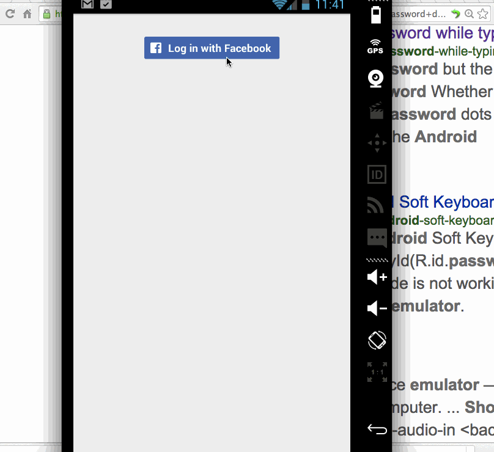

# HakunaMatata

"Hakuna matata" is a Swahili phrase; translated, it roughly means "No worries".  In this project we're going to build an app which can make people laugh. It's a platform that collect jokes, funny images and funny videos. Also users can post and share their joke on it. We use facebook as the content storage.

(Required)
* [x] User have to loggin into facebook
* [x] User can view the list of content without login. The content will be separated under three tabs
* [x] There's a favorite list
  * [x] User can add jokes into his favorite list
  * [x] User can remove jokes from favorite list
* [x] User can post content onto the platform
  * [x] User can post a text joke
  * [x] User can post a funny image and add the description
* [x] The data will be stored on a open facebook group
* [x] Add cool animation and style on the app

## Walkthrough (Milestone)

## Developer setup
* For Mac OSX, copy `key/debug.keystore` to `~/.android/`
