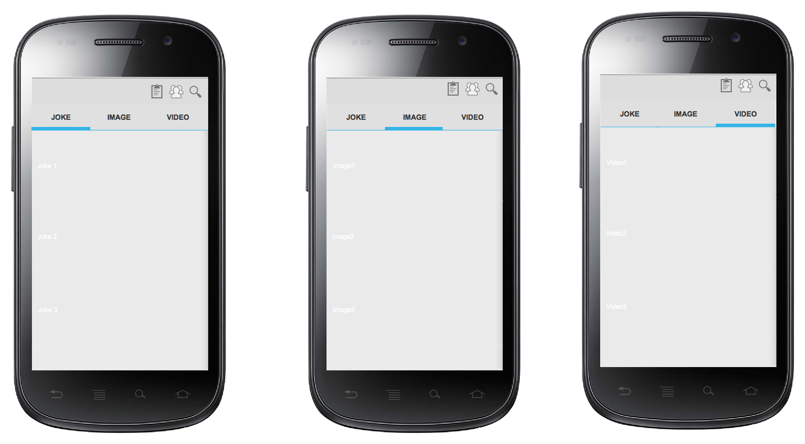
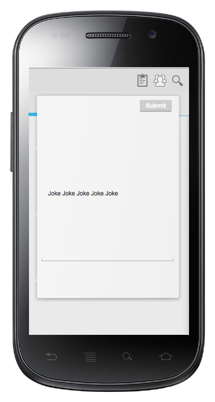
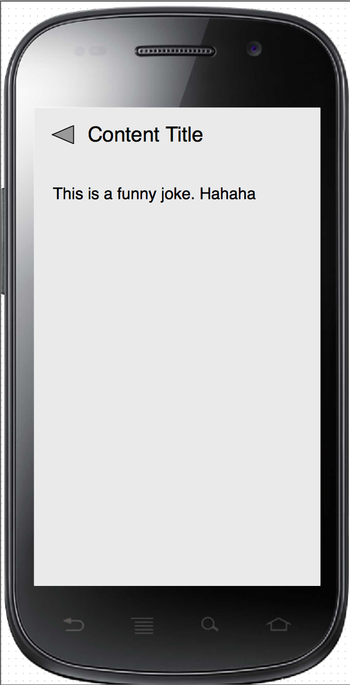

# HakunaMatata

"Hakuna matata" is a Swahili phrase; translated, it roughly means "No worries".  In this project we're going to build an app which can make people laugh. It's a platform that collect jokes, funny images and funny videos. Also users can post and share their joke on it. We use facebook as the content storage.

(Required)
* [ ] User can view the list of content without login. The content will be separated under three tabs
  * [ ] User can view the joke under the joke tab
  * [ ] User can view the funny images under the funny images tab
  * [ ] User can view the funny video under the funny video tags
* [ ] Usr can view the detail of each post
* [ ] There's a hot list for each tab that shows the most populared posts
* [ ] User can post content onto the platform
  * [ ] User have to loggin into facebook before posting
  * [ ] User can choose post type within (joke, image,video)
  * [ ] User can post a text joke
  * [ ] User can post a funny image and add the description
  * [ ] User can post a funny video and add the description
* [ ] The data will be stored on a open facebook group

(Optional)
* [ ] User can shared the post
* [ ] User can search the content by keyword
* [ ] User can add the post to the favourite list
* [ ] User the view the favourite list
* [ ] User can setting the preference

## Wireframe

Tab Pages

Submit page

Login Page

Detail Page

GIF created with [Pencil](http://pencil.evolus.vn/).

## Developer setup
* For Mac OSX, copy `key/debug.keystore` to `~/.android/`
